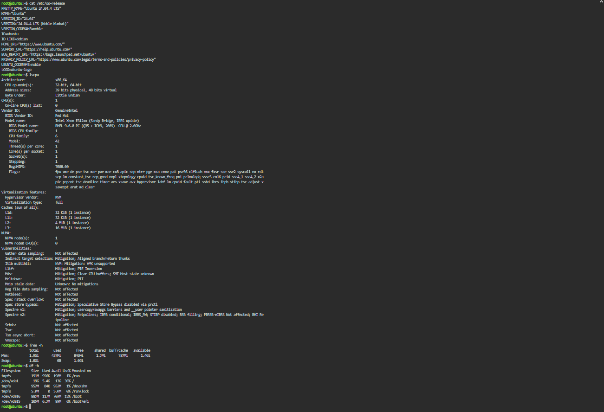

# Laboratory-03-Multi-Cloud-Explorer

## Overview
This directory contains research, platform comparisons, client recommendations, and terminal investigation logs evaluating Amazon Web Services (AWS), Microsoft Azure, and Google Cloud Platform (GCP).

---

## Checkpoint 7: Linux Investigation

### Terminal Hardware & System Information
* **Operating System:** Ubuntu 24.04.4 LTS (Noble Numbat)
* **Kernel Version:** 6.8.0-136-generic
* **CPU Information:** x86_64 Architecture, Intel Xeon E312xx (1 vCPU, 1 Socket, 1 Core per socket)
* **Memory (RAM):** 1.9 GiB Total (1.4 GiB Available)
* **Disk Space:** 13 GB Available

### Terminal Output Evidence

### Cloud Migration Options
If this Linux server environment were migrated to the public cloud, it could be hosted on the following virtualized infrastructure services:
* **Amazon Web Services (AWS):** Amazon EC2 instance (e.g., t3.micro or t2.micro)
* **Microsoft Azure:** Azure Linux Virtual Machine (e.g., Standard_B1s)
